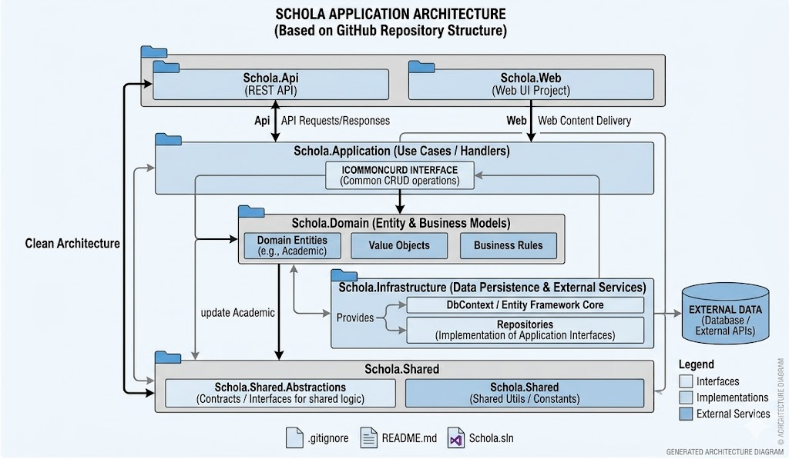
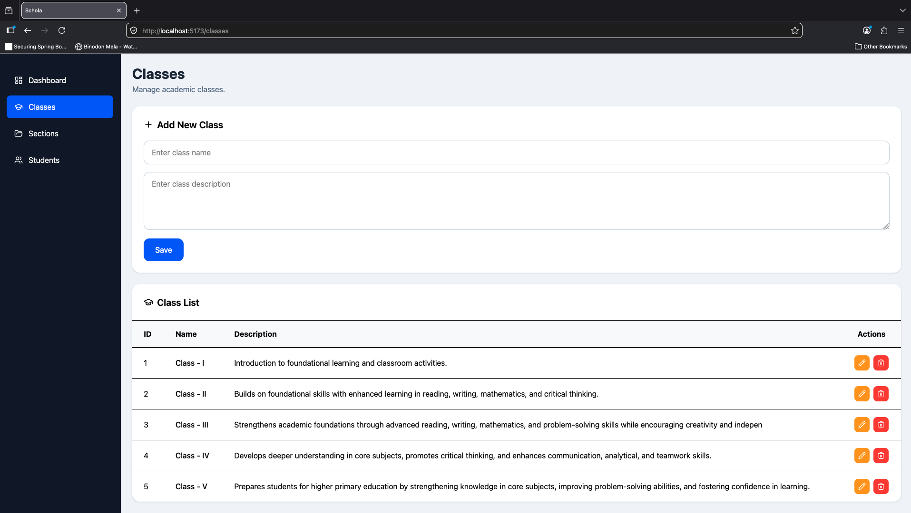
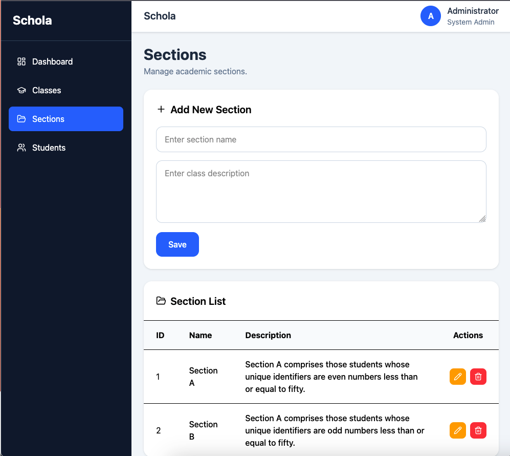

# Donora — School Management Ecosystem

Donora is a modern, high-performance school management ecosystem designed to streamline the complexities of educational administration. Built with enterprise-grade software design patterns and a robust technical stack, the platform ensures scalability, strict maintainability, and top-tier transactional performance.

---

## 🛠️ Architecture & Design Principles

The core system is engineered to decouple business logic from external frameworks, ensuring the codebase remains highly testable, scannable, and adaptable over time.

*   **Clean Architecture:** Organizes the solution into independent layers where dependencies point strictly inward, isolating core domain rules from UI, databases, and external APIs.
*   **CQRS (Command Query Responsibility Segregation):** Separates read and write operations into distinct pipelines to optimize data processing, performance, and scaling boundaries.
*   **SOLID Principles:** Strictly enforces object-oriented design fundamentals to minimize regression bugs and maximize modularity.
*   **DRY & Clean Code Practices:** Eliminates logic redundancy across modules, keeping the repository highly readable and maintainable for engineering teams.

---

## 🚀 Technology Stack

### Backend

* ASP.NET Core (.NET)
* Entity Framework Core (EF Core)
* CQRS (Command Query Responsibility Segregation)
* Clean Architecture
* RESTful Web APIs

### Frontend

* React.js
* TypeScript
* Vite
* Clean Architecture

### Database

* MySQL
* Oracle PL/SQL

### Architecture & Design Patterns

* Domain-Driven Design (DDD)
* CQRS Pattern
* Repository Pattern
* Dependency Injection
* SOLID Principles

### Development Tools

* Visual Studio / VS Code
* Git & GitHub
* Postman
* Swagger / OpenAPI

## 📌 Key Features

* Scalable Clean Architecture
* Separation of Read and Write Operations (CQRS)
* Secure REST API Integration
* MySQL Database Support
* Modern React + TypeScript Frontend
* Domain-Driven Design (DDD) Approach

# Architecture Diagram

---
# Screenshot

* CQRS Pattern
* Entity Framework Core
* MySQL
* REST API
* OpenAPI / Swagger

## Contributing

Contributions are welcome. Feel free to submit issues, feature requests, or pull requests to help improve Fundora.

## Sponsorship

If you find Fundora useful, please consider sponsoring the project. Your support helps us maintain the platform, improve existing features, develop new capabilities, and ensure the long-term sustainability of the project.

We appreciate the support of individuals, organizations, and businesses that believe in open-source software and transparent donation management.

## License

This project is licensed under the MIT License.
>>>>>>> 3ea7eb19755ad51eaa39c18086f752b9f3d08bae
